# Hi, I'm Souvik Kundu 👋

<picture>
  <source media="(prefers-color-scheme: dark)" srcset="./dark.svg">
  <source media="(prefers-color-scheme: light)" srcset="./light.svg">
  
</picture>

  <b>Computer Science Engineer · Full-Stack Developer · Systems &amp; 60fps Mobile Builder</b>

  ☕ Java &nbsp;·&nbsp; 🐍 Python &nbsp;·&nbsp; ⚛️ React &nbsp;·&nbsp; 📱 Kotlin (Compose)
  &nbsp;·&nbsp; ⚙️ Node.js &nbsp;·&nbsp; 🐳 Docker &nbsp;·&nbsp; ☁️ AWS &nbsp;·&nbsp; 🧠 Computer Vision

I build **scalable full-stack applications, intelligent AI systems, real-time computer vision tools, and ultra-fluid 60fps native mobile experiences**.

My current engineering interests sit at the intersection of **Full-Stack Architectures, Java &amp; Spring Boot, Python &amp; AI / Computer Vision, Kotlin &amp; Jetpack Compose, and Cloud Infrastructure**.

---

## 🤖 What I Build

- 🧠 **AI & Computer Vision Applications** — real-time gesture controllers, webcam vision systems, OpenCV and MediaPipe pipelines
- ⚛️ **Full-Stack Web Platforms** — healthcare platforms (CareFlow), automotive intelligence (CARX), React & TypeScript architectures
- 📱 **Ultra-Fluid Android Apps** — 60fps Jetpack Compose native apps with particle physics simulations and frosted glass UIs (Weather)
- ⚙️ **Backend & Distributed Systems** — REST APIs, Spring Boot microservices, Node.js, and database optimization
- 🔐 **Native Security & Biometrics** — local face recognition and macOS biometric authentication systems (MacSight)
- 🚑 **Smart City & IoT Corridors** — real-time GPS signal preemption and emergency vehicle routing (SmartCare)
- 📈 **Performance & System Design** — 60fps physics, clean component architectures, and responsive workflows

---

## 💼 Experience & Academics

### Computer Science & Engineering Undergraduate
**B.Tech in Computer Science & Engineering**

Working across modern software engineering with a primary focus on **full-stack architecture, machine learning integration, and high-performance native apps**.

- Building production-quality applications with **React, TypeScript, Next.js, and Tailwind CSS**
- Engineering backend services and REST APIs with **Java, Spring Boot, Python, and Node.js**
- Developing fluid native Android applications with **Kotlin and Jetpack Compose featuring 60fps particle physics**
- Constructing computer vision pipelines using **OpenCV and MediaPipe** for touch-free gesture ecosystems
- Architecting database schemas and query performance with **PostgreSQL and MySQL**
- Managing cloud and container workflows with **Docker, AWS, Git, and Linux**
- Maintaining **17+ public repositories** spanning full-stack, systems, mobile, and AI

---

## 🧩 Featured Projects

### 🏥 CareFlow — AI-Powered Hospital Management
[GitHub Repository](https://github.com/Souvik7661/CareFlow)

AI-powered hospital management platform that streamlines patient registration, triage, and doctor availability.

- Symptom-based doctor recommendation and automated queue optimization
- Integrated medical records, prescriptions, and digital patient flow
- Secure, scalable healthcare workflow architecture
- **TypeScript · React · Next.js · Queue Optimization · Healthcare AI**

### 🚗 CARX — AI Vehicle Intelligence Platform
[GitHub Repository](https://github.com/Souvik7661/CARX)

AI-powered automotive intelligence platform that evaluates vehicle records, service history, and condition to guide used car purchases.

- Analyzes damage reports, mileage, fair market value, and repair risks
- Delivers explainable *BUY*, *NEGOTIATE*, or *AVOID* recommendations
- Document intelligence and structured decision-making pipeline
- **TypeScript · Full-Stack · AI Intelligence · Data Analytics**

### 🌦️ Weather — 60fps Jetpack Compose Android App
[GitHub Repository](https://github.com/Souvik7661/Weather)

Modern, ultra-fluid Android weather app featuring real-time atmospheric particle physics.

- 60fps particle physics simulation: dripping rain on glass, volumetric lightning, and 3D snow
- Dual-tier GPS geocoding, contextual weather advisories, and frosted glass 24h forecast pill
- Clean architecture with Jetpack Compose and modern Android best practices
- **Kotlin · Jetpack Compose · Atmospheric Physics · Android SDK**

### 👁️ MacSight — Native macOS Biometric Face Authentication
[GitHub Repository](https://github.com/Souvik7661/MacSight)

macOS Face ID–style biometric authentication system using local facial recognition.

- Privacy-focused zero-cloud on-device face recognition
- Seamless native authentication and macOS device integration
- **Swift · macOS Native · Computer Vision · Local Biometrics**

### 🖐️ VirtualMouse & Gesture Simulation
[GitHub Repository](https://github.com/Souvik7661/VirtualMouse)

Touch-free PC controller and real-time particle physics simulation driven by webcam hand tracking.

- Real-time hand tracking, air clicks, gesture-mapped force fields (gravity well, scatter, freeze)
- Pure in-browser and local Python execution using OpenCV & MediaPipe
- **Python · OpenCV · MediaPipe · React · Canvas API**

---

## 🛠️ Engineering Stack

### ☕ Languages
`Java` `Python` `TypeScript` `JavaScript` `Kotlin` `C / C++` `Swift` `SQL`

### ⚛️ Frontend & Mobile
`React` `Next.js` `Jetpack Compose` `Android SDK` `Tailwind CSS` `HTML5 / CSS3` `Canvas API`

### ⚙️ Backend
`Node.js` `Express` `Spring Boot` `Django` `REST APIs` `Microservices`

### 🗄️ Databases
`PostgreSQL` `MySQL` `MongoDB` `Database Design`

### ☁️ Cloud & DevOps
`Docker` `AWS` `Linux` `Git` `GitHub Actions` `Nginx`

### 🧠 AI & Computer Vision
`OpenCV` `MediaPipe` `Machine Learning` `LLM APIs` `Particle Simulation`

### 🏗️ Architecture & Concepts
`System Design` `Object-Oriented Programming (OOP)` `Data Structures & Algorithms` `Clean Architecture` `60fps Native UI`

---

## ✍️ Technical Focus & Engineering Principles

I focus on **systems performance, full-stack scalability, 60fps mobile physics, and real-world AI applications**:

- **Real-Time Physics & Graphics** — Designing 60fps interactive particle physics in Jetpack Compose and Canvas
- **Computer Vision Pipelines** — Building contactless human-computer interfaces using OpenCV and MediaPipe
- **Clean Architecture & Resilience** — Writing modular backends with Java, Spring Boot, and Node.js
- **Practical AI Applications** — Integrating machine learning models for document analysis, diagnostics, and workflow automation

---

## 📊 GitHub Activity

  

<h2 align="center">Contribution Activity</h2>

  <picture>
    <source
      media="(prefers-color-scheme: dark)"
      srcset="https://raw.githubusercontent.com/Souvik7661/Souvik7661/output/github-snake-dark.svg"
    />
    <source
      media="(prefers-color-scheme: light)"
      srcset="https://raw.githubusercontent.com/Souvik7661/Souvik7661/output/github-snake.svg"
    />
    
  </picture>

---

## 🎧 Now Playing & Vibe

  

---

## 📫 Connect With Me

  🌐 <a href="https://github.com/Souvik7661/Portfolio">Portfolio</a> 
  💼 <a href="https://github.com/Souvik7661">GitHub (@Souvik7661)</a> 
  📧 <a href="mailto:souvikk075@gmail.com">Email (souvikk075@gmail.com)</a>

> **Build scalable systems. Write clean code. Ship real-world impact.**
